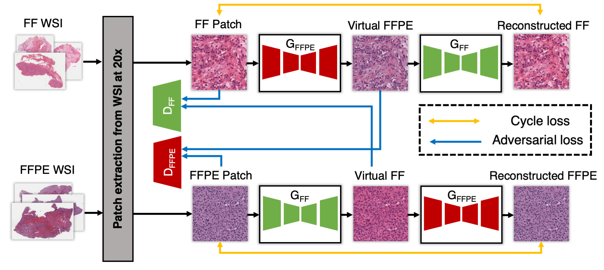

# A generative adversarial approach to facilitate archival-quality histopathologic diagnoses from frozen tissue sections
### [Paper](https://arxiv.org/abs/2107.11786v2)
```
@misc{falahkheirkhah2021generative,
      title={A generative adversarial approach to facilitate archival-quality histopathologic diagnoses from frozen tissue sections}, 
      author={Kianoush Falahkheirkhah and Tao Guo and Michael Hwang and Pheroze Tamboli and Christopher G Wood and Jose A Karam and Kanishka Sircar and Rohit Bhargava},
      year={2021},
      eprint={2108.10550},
      archivePrefix={arXiv},
      primaryClass={eess.IV}
}
```


We develop a deep learning framework to convert images of frozen samples into FFPE, which we termed virtual-FFPE. To better transform the information, we modified the architecture of the generator and we used a multi-scale dicriminator. Our results demonstrate that the virtual FFPE are of high quality and increase inter-observer agreement, as calculated by Fleiss’ kappa, for detecting cancerous regions and assigning a grade to clear cell RCC within the sample.

## Requirements
- This source has been tested on Ubuntu 18.04.4 and macOS Big Sur
- CPU or NVIDIA GPU (for training, we recommend having a >10GB GPU)
- Python 3.7.1 
- CUDA 10.1
- PyTorch 1.3

## Python Dependencies
- numpy
- scipy
- torch
- torchvision
- sys
- PIL

## Training and testing

- The training dataset is available upon reasonable request. 
- To train the virtual-FFPE model, please use this command:
```bash
python training.py --n_epochs [numberof epochs] --dataset_dir [directory of the dataset] --batch_size [batch size] --lr [learning rate] 
```
-For testing, please use this:
```bash
python test.py --dataset_dir [directory of the dataset] --batch_size [batch size] 
```
For reproducing the results you can download the pretrain model from [here.](https://uofi.box.com/s/9g6epqfmhf55ewembqio6t09imsd3uwq)

### Results


### References
https://github.com/NVlabs/SPADE |
https://github.com/eriklindernoren/PyTorch-GAN |
https://github.com/vacancy/Synchronized-BatchNorm-PyTorch
